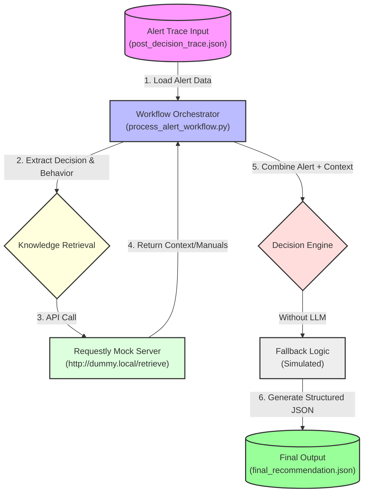

<<<<<<< HEAD
# Trace Engine — Decision Transparency Core

## What this component is

The **Trace Engine** is a deterministic decision recorder for industrial alerts.
It captures **how and why** an alert was triggered by recording every rule that fired, in order, with exact thresholds and confidence impact.

**This component is the source of truth for all alerts.**

---

## What problem it solves

In most predictive maintenance systems:
- Alerts are opaque.
- Engineers don’t know why something fired.
- Trust breaks down.

The Trace Engine fixes this by making every decision:
- **Inspectable**
- **Replayable**
- **Auditable**

**If an alert exists, a trace exists.**

---

## What the Trace Engine does

For each incoming feature record:

1.  **Receives** processed sensor features (not raw signals).
2.  **Applies** deterministic, human-defined rules.
3.  **For every rule that fires:**
    -   Records the feature value.
    -   Records the threshold.
    -   Records the comparison.
    -   Updates and records confidence.
4.  **Produces** a structured decision trace (JSON).

The trace shows **what happened**, **when it happened**, **why it happened**, and **how risk accumulated**.

### What it does NOT do

The Trace Engine does **not**:
- Run machine learning models.
- Generate natural language explanations.
- Suggest fixes.
- Infer causality.
- Learn or adapt rules.
- Modify data.

Explanation and remediation happen *after* the trace, using this output.

---

## Input contract

The Trace Engine expects a single feature record in this format:

```json
{
  "timestamp": "ISO-8601",
  "component": "PUMP | CONVEYOR | COMPRESSOR",
  "features": {
    "vibration_rms": float,
    "vibration_trend": float,
    "vibration_delta": float,
    "temperature_c": float,
    "temperature_delta": float,
    "load_avg": float
  }
}
```

*Feature extraction is handled upstream. The Trace Engine does not validate or correct features.*

---

## Output contract (decision trace)

Each alert produces exactly one decision trace:

```json
{
  "alert_id": "...",
  "component_id": "...",
  "timestamp": "...",
  "decision": "NORMAL | BORDERLINE | DANGER",
  "final_confidence": 0.0,
  "rules_triggered": [],
  "reasoning_trace": [
      {
          "step_id": 1,
          "rule": "RULE_NAME",
          "feature": "feature_name",
          "value": 0.0,
          "threshold": 0.0,
          "rule_result": "FIRED",
          "confidence_after_step": 0.0
      }
  ],
  "expected_behavior": "NORMAL",
  "observed_behavior": "DEGRADING",
  "expectation_mismatch": true
}
```

### Key fields
- **`reasoning_trace`**: Ordered list of fired rules with thresholds and confidence.
- **`final_confidence`**: Deterministic risk score (not probability).
- **`expectation_mismatch`**: Flags deviation from normal behavior.

---

## Confidence semantics

Confidence is a **deterministic risk score (0–1)**.
- Each fired rule adds a fixed amount.
- Confidence accumulates step-by-step.
- **It is not a probability.**

This makes risk progression visible and debuggable.

---

## Why this is not XAI

**Explainable AI (XAI)** tries to explain black-box models *after* a decision.

The **Trace Engine**:
- Records the decision *as it happens*.
- Does not guess explanations.
- Works even without ML.

**XAI explains models. The Trace Engine records decisions.**

---

## Why judges should care

With this component, a judge (or engineer) can:
1.  Point to an alert.
2.  Ask **“why?”**.
3.  See the exact reasoning path in seconds.
4.  Spot incorrect logic immediately.

**This builds real trust, not decorative explainability.**

---

## Demo notes

For the demo:
- Rules are **manually defined**.
- Thresholds are **static**.
- Data is **deterministic**.

This is intentional to maximize clarity and auditability.

---

## Summary

- If the Trace Engine is clear, the system is trustworthy.
- If the Trace Engine is vague, nothing else matters.

**This component makes system intelligence visible.**
=======
# 🏭 Explainable Predictive Maintenance System

## 📌 Project Overview

This project implements a **trace-first predictive maintenance system** designed to solve the "black box" problem in industrial AI. Instead of just outputting an alert, this system:
1.  **Captures the decision trace**: Records *why* an alert was triggered.
2.  **Retrieves context**: Uses a RAG (Retrieval-Augmented Generation) pattern to find relevant maintenance manuals and historical data.
3.  **Generates actionable advice**: Uses an LLM (or structured fallback) to convert the trace and context into specific, safe maintenance instructions.

The core philosophy is: **If a system cannot show how it reasoned, it should not be trusted.**

---

## 🏗️ System Architecture & Pipeline

The system operates in a linear pipeline from Alert Generation to Final Recommendation.

### 🔄 Data Flow Pipeline



---

## 📂 File Structure & Responsibilities

| File Name | Responsibility |
| :--- | :--- |
| **`process_alert_workflow.py`** | **The Main Engine.** Orchestrates the entire flow: reads the alert, calls the retrieval API, prompts the LLM, and saves the result. |
| **`post_decision_trace.json`** | **Input.** The "black box" alert trace. Contains the `decision` (e.g., "Early Bearing Degradation") and `observed_behavior`. |
| **`final_recommendation.json`** | **Output.** The final, actionable JSON containing recommended actions, safety notes, and references. |
| **`requestly_mock_rules.md`** | **Retrieval Logic.** Defines the rules for `Requestly` to intercept the dummy API call and return specific knowledge chunks. |
| **`requestly_export.json`** | **Mock Data.** The importable configuration for Requestly to simulate the knowledge base API. |
| **`maintenance_chunks.json`** | **Knowledge Base.** Chunks of text from maintenance manuals used for retrieval. |
| **`vectorDB.json`** | **Index.** Metadata used to map alerts to specific knowledge chunks (simulated vector store). |

---

## 🚀 How to Run the System

### Prerequisites
- Python 3.8+
- [Requestly Desktop App](https://requestly.io/) (for mocking the API)
- A Groq API Key (Optional, for LLM generation)

### Step-by-Step Execution

1.  **Prepare the Input Trace**:
    Ensure `post_decision_trace.json` contains the latest alert data.
    ```json
    {
      "input_trace": {
        "decision": "EARLY_BEARING_DEGRADATION",
        "observed_behavior": "rapid temperature spike"
      }
    }
    ```

2.  **Setup Requestly Mock** (Crucial Step):
    *   Open Requestly.
    *   Import `requestly_export.json` OR manually set up a rule to redirect `http://dummy.local/retrieve` to return valid JSON context.
    *   Ensure the Requestly system proxy is active.

3.  **Run the Workflow**:
    ```bash
    # Set your API key (optional)
    $env:GROQ_API_KEY="your_api_key_here" 

    # Execute the script
    python process_alert_workflow.py
    ```

4.  **View Results**:
    Open `final_recommendation.json` to see the generated maintenance advice.

    **Example Output:**
    ```json
    {
      "recommended_action": [
        "Check lubrication levels immediately.",
        "Schedule bearing replacement within 5–10 days."
      ],
      "safety_note": "Ensure power is isolated before inspection.",
      "reference": "Internal Knowledge Base"
    }
    ```

---

## 🧠 Decision Trace Philosophy

The system is built on the idea that **explainability must be intrinsic, not post-hoc**.
*   **Traditional AI**: Makes a guess -> Explainability tool tries to guess why.
*   **This System**: Records the logic path -> Retrieval simply adds context to that proven path.

This ensures that `final_recommendation.json` is always mathematically consistent with the input `post_decision_trace.json`.
>>>>>>> 8d6b38b7fb92eeb145fb93da087c5e652c26a73a
