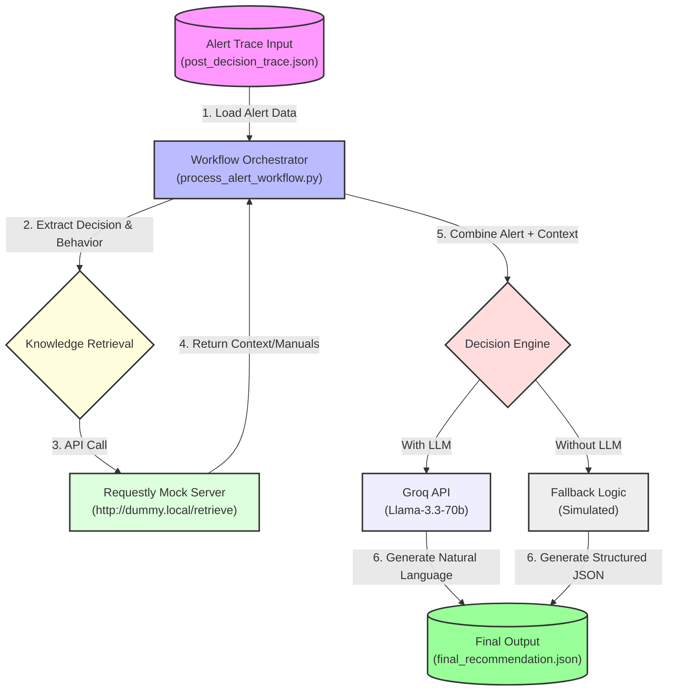

# 🏭 Explainable Predictive Maintenance System

## 📌 Project Overview

This project implements a **trace-first predictive maintenance system** designed to solve the "black box" problem in industrial AI. Instead of just outputting an alert, this system:
1.  **Captures the decision trace**: Records *why* an alert was triggered.
2.  **Retrieves context**: Uses a RAG (Retrieval-Augmented Generation) pattern to find relevant maintenance manuals and historical data.
3.  **Generates actionable advice**: Uses an LLM (or structured fallback) to convert the trace and context into specific, safe maintenance instructions.

The core philosophy is: **If a system cannot show how it reasoned, it should not be trusted.**

---

## 🏗️ System Architecture & Pipeline

The system operates in a linear pipeline from Alert Generation to Final Recommendation.

### 🔄 Data Flow Pipeline



---

## 📂 File Structure & Responsibilities

| File Name | Responsibility |
| :--- | :--- |
| **`process_alert_workflow.py`** | **The Main Engine.** Orchestrates the entire flow: reads the alert, calls the retrieval API, prompts the LLM, and saves the result. |
| **`post_decision_trace.json`** | **Input.** The "black box" alert trace. Contains the `decision` (e.g., "Early Bearing Degradation") and `observed_behavior`. |
| **`final_recommendation.json`** | **Output.** The final, actionable JSON containing recommended actions, safety notes, and references. |
| **`requestly_mock_rules.md`** | **Retrieval Logic.** Defines the rules for `Requestly` to intercept the dummy API call and return specific knowledge chunks. |
| **`requestly_export.json`** | **Mock Data.** The importable configuration for Requestly to simulate the knowledge base API. |
| **`maintenance_chunks.json`** | **Knowledge Base.** Chunks of text from maintenance manuals used for retrieval. |
| **`vectorDB.json`** | **Index.** Metadata used to map alerts to specific knowledge chunks (simulated vector store). |

---

## 🚀 How to Run the System

### Prerequisites
- Python 3.8+
- [Requestly Desktop App](https://requestly.io/) (for mocking the API)
- A Groq API Key (Optional, for LLM generation)

### Step-by-Step Execution

1.  **Prepare the Input Trace**:
    Ensure `post_decision_trace.json` contains the latest alert data.
    ```json
    {
      "input_trace": {
        "decision": "EARLY_BEARING_DEGRADATION",
        "observed_behavior": "rapid temperature spike"
      }
    }
    ```

2.  **Setup Requestly Mock** (Crucial Step):
    *   Open Requestly.
    *   Import `requestly_export.json` OR manually set up a rule to redirect `http://dummy.local/retrieve` to return valid JSON context.
    *   Ensure the Requestly system proxy is active.

3.  **Run the Workflow**:
    ```bash
    # Set your API key (optional)
    $env:GROQ_API_KEY="your_api_key_here" 

    # Execute the script
    python process_alert_workflow.py
    ```

4.  **View Results**:
    Open `final_recommendation.json` to see the generated maintenance advice.

    **Example Output:**
    ```json
    {
      "recommended_action": [
        "Check lubrication levels immediately.",
        "Schedule bearing replacement within 5–10 days."
      ],
      "safety_note": "Ensure power is isolated before inspection.",
      "reference": "Internal Knowledge Base"
    }
    ```

---

## 🧠 Decision Trace Philosophy

The system is built on the idea that **explainability must be intrinsic, not post-hoc**.
*   **Traditional AI**: Makes a guess -> Explainability tool tries to guess why.
*   **This System**: Records the logic path -> Retrieval simply adds context to that proven path.

This ensures that `final_recommendation.json` is always mathematically consistent with the input `post_decision_trace.json`.
